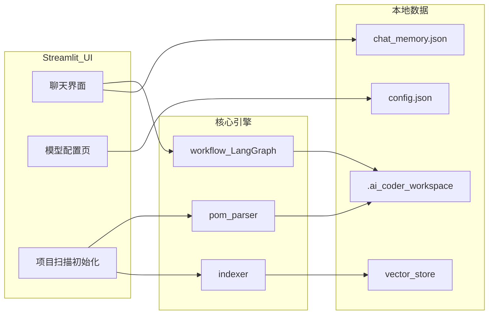

# AI Coder Studio（AI 架构师工作台）

面向 **Java / Maven** 业务仓库的本地 **AI 编程助手**：在 **不修改目标项目源码结构** 的前提下，挂载任意工程路径，自动解析技术栈、构建语义索引，并通过多智能体流水线完成「检索上下文 → 架构规划 →（人工确认）→ 生成代码 → Maven 编译校验」的闭环。  
工具侧提供 **Streamlit 图形界面**、集中式 **大模型配置** 与 **按项目隔离的聊天长期记忆**。

---

## 为什么需要这个工具

- **本地优先**：索引与报告落在本机工作目录，代码与密钥不依赖云端托管。
- **RAG + 多 Agent**：用 LlamaIndex 做代码/SQL 语义检索，用 LangGraph 编排 Librarian / Architect / Human / Coder / QA 角色。
- **贴近真实研发**：针对 Maven 工程做技术栈报告、领域模型推断，并在流水线末端尝试 `mvn compile` 做自动纠错循环（需本机已安装 Maven）。
- **配置可运维**：支持 `.env` 默认值 + UI/本地 JSON 多套模型档案（Chat 与 Embedding 分离）。

---

## 功能概览

| 能力 | 说明 |
|------|------|
| **项目挂载** | 输入目标仓库绝对路径；为每个项目生成独立工作区 `.ai_coder_workspace/<md5>/` |
| **初始化扫描** | 解析 `pom.xml` 依赖链、可选扫描 `*.sql` 生成领域文档、构建 LlamaIndex 向量库 |
| **聊天驱动编码** | 自然语言需求触发 LangGraph 工作流，结合检索结果生成修改计划与代码 |
| **人工审核断点** | 图在 `Human` 节点前中断，可在 UI 中批准或驳回后继续执行 |
| **QA 节点** | 在配置的工作目录下执行 Maven 编译，失败时可打回 Coder 重试 |
| **模型配置** | 列表式管理多套 Chat / Embedding 配置，启用、编辑、删除 |
| **长期记忆** | 每个项目工作区内 `chat_memory.json`，默认保留最近约 200 条消息 |

---

## 架构示意



**典型 Agent 流程（简化）**

1. **Librarian**：从本地 `vector_store` 检索与需求相关的代码/SQL 片段。  
2. **Architect**：结合上下文输出结构化修改计划（Markdown）。  
3. **Human**：人工批准或驳回（LangGraph `interrupt_before` + UI 恢复执行）。  
4. **Coder**：按计划生成 JSON 数组，写入目标路径下的 Java 等文件。  
5. **QA**：在指定目录执行 `mvn clean compile`，失败则带错重试。

---

## 环境要求

- **Python**：建议 **3.10+**（开发验证使用 3.12）。  
- **操作系统**：Windows / macOS / Linux 均可（路径说明以 Windows 为例时在文档中单独标注）。  
- **目标项目**：根目录含 **`pom.xml`** 的 Maven Java 工程（多模块场景下解析器会递归父 POM）。  
- **可选**：本机安装 **Maven** 与 **JDK**，以便 QA 节点真实编译；未安装时相关步骤会失败。  
- **大模型**：需兼容 **OpenAI API** 形态的端点（`base_url` + `api_key`），Chat 与 Embedding 可指向同一或不同供应商。

---

## 快速开始

### 1. 克隆仓库

```bash
git clone https://github.com/<your-org>/<repo-name>.git
cd <repo-name>
```

### 2. 创建虚拟环境并安装依赖

```bash
python -m venv .venv

# Windows
.venv\Scripts\activate

# macOS / Linux
source .venv/bin/activate

pip install -U pip
pip install -r requirements.txt
```

依赖版本以仓库根目录 [`requirements.txt`](requirements.txt) 为准（由当前开发环境 `pip freeze` 导出，可按需精简或升级）。

### 3. 配置环境变量

复制示例文件并编辑（**切勿将真实 Key 提交到 Git**）：

```bash
copy .env.example .env   # Windows
# cp .env.example .env   # Unix
```

`.env` 中支持下列 **默认值**（首次生成 `config.json` 时会作为默认档案填入，也可在 UI 中另建多套配置）：

| 变量 | 含义 |
|------|------|
| `AI_CODER_DEFAULT_CHAT_API_KEY` | Chat 补全所用 API Key |
| `AI_CODER_DEFAULT_CHAT_BASE_URL` | Chat 兼容端点 Base URL |
| `AI_CODER_DEFAULT_CHAT_MODEL` | Chat 模型名 |
| `AI_CODER_DEFAULT_EMBEDDING_API_KEY` | 向量 Embedding Key |
| `AI_CODER_DEFAULT_EMBEDDING_BASE_URL` | Embedding Base URL |
| `AI_CODER_DEFAULT_EMBEDDING_MODEL` | Embedding 模型名（默认示例 `text-embedding-3-small`） |

### 4. 启动 Web 界面

```bash
streamlit run app.py
```

浏览器打开提示的本地地址后：

1. 在侧边栏 **模型配置** 中补全或切换 Chat / Embedding 档案并 **启用** 一套。  
2. 输入 **目标项目绝对路径**，执行 **扫描/初始化**（首次或缓存失效时）。  
3. 在主界面用 **自然语言** 描述需求，等待流水线执行；若停在人工审核，请按界面提示 **批准或驳回**。

### 5.（可选）命令行初始化

```bash
python cli.py init path\to\your-maven-project
```

当前仓库中 `cli.py` 的 `do` 子命令为占位说明，实际「对话式编码」以 **Streamlit + `workflow.agent_app`** 为准。

---

## 配置说明

### 分层策略

1. **`.env`**：机器级默认值，适合镜像/部署时注入，不进入版本库（见 `.gitignore`）。  
2. **`.ai_coder_workspace/config.json`**：由程序与用户界面读写，可保存 **多套** Chat / Embedding 配置及当前启用项。  
3. **项目工作区** `.ai_coder_workspace/<项目路径哈希>/`：每项目独立，包含报告、向量库、聊天记忆等。

### 向量索引位置

- **推荐**：索引持久化在当前工具工作区下的 `vector_store/`（不污染业务仓库）。  
- **兼容**：若曾将索引建在目标项目下的 `.ai_coder_knowledge/vector_store/`，Librarian 会在新路径不存在时 **回退读取** 旧路径。

---

## 目录结构（核心文件）

```
.
├── app.py                 # Streamlit 主应用（聊天、初始化、模型配置、记忆）
├── workflow.py            # LangGraph 多智能体编排与 checkpoint
├── config_manager.py      # .env + config.json，Chat/Embedding 客户端工厂
├── memory_manager.py     # 按项目的 chat_memory.json
├── indexer.py             # LlamaIndex 建库与持久化
├── pom_parser.py          # Maven POM 递归解析与技术栈报告（LLM）
├── extractor.py           # Java AST 元数据抽取（tree-sitter-java）
├── cli.py                 # Typer 命令行（init 等）
├── analyzer.py            # 单文件 Java 分析脚本示例
├── ddl_analyzer.py        # DDL 批量分析脚本示例
├── requirements.txt       # Python 依赖锁定（pip freeze）
├── LICENSE                # MIT 许可证
├── .env.example           # 环境变量模板
└── .gitignore             # 忽略 .env、工作区与缓存
```

---

## 安全与隐私

- **API Key** 仅应出现在本机 `.env` 或本地 `config.json` 中；开源前务必检查 **无密钥、无内网 URL** 残留。  
- 工具会读取目标项目中的源码与 SQL 用于索引与提示词，请在合规前提下使用。  
- 聊天记忆以 **明文 JSON** 存储于本地，若环境多人共用，请注意磁盘权限。

---

## 常见问题（FAQ）

**Q：初始化或对话报错「配置不完整」？**  
A：在模型配置页为 **当前启用的** Chat 与 Embedding 档案填写完整的 `api_key`、`base_url`、`model`。

**Q：提示找不到向量索引？**  
A：请先对当前项目路径完成一次完整扫描；或确认 `.ai_coder_workspace/<hash>/vector_store` 是否存在。

**Q：QA 编译总是失败？**  
A：确认本机 `mvn`、`JAVA_HOME` 可用；工作流里 Maven 的工作目录与业务项目布局有关，必要时需在 `workflow.py` 中按实际模块根目录调整。

**Q：对话历史丢失？**  
A：历史按 **项目路径** 隔离，切换路径会加载另一项目的 `chat_memory.json`；单文件默认只保留最近约 200 条。

---

## 与会者（Credits）

- [Streamlit](https://streamlit.io/) — Web UI  
- [LlamaIndex](https://www.llamaindex.ai/) — 向量检索与索引  
- [LangGraph](https://github.com/langchain-ai/langgraph) — 有状态多步 Agent  
- [OpenAI Python SDK](https://github.com/openai/openai-python) — 兼容多种厂商的 HTTP API  
- [tree-sitter](https://tree-sitter.github.io/tree-sitter/) — Java 语法解析  

---

## 开源与许可

欢迎 Issue / PR。改进方向可包括：更完善的 CLI、非 Maven 项目模板、更细的多模块 Maven 编译路径、以及更安全的密钥托管方案。

本项目默认采用 **MIT** 许可证，全文见仓库根目录 [`LICENSE`](LICENSE)。如需变更版权归属，请修改 `LICENSE` 中的 Copyright 行。

---

**免责声明**：本工具会调用大模型并可能自动修改本地文件，请在版本控制（Git）下使用，并在执行前自行审查生成内容与编译结果。
